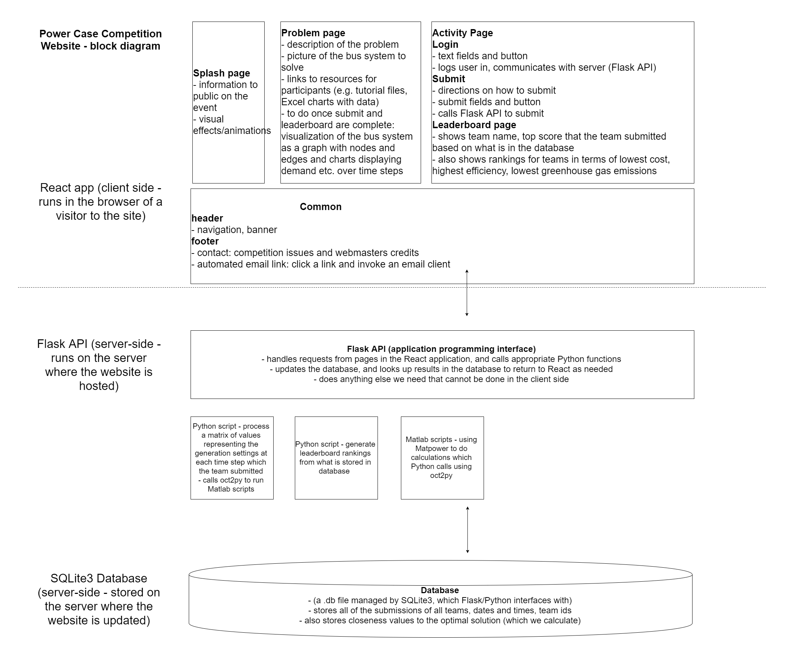

# pcc-web
Web interface for the IEEE U of T Power Case Competition.

## To download and run:

<code>git clone https://github.com/bryandebourbon/PowerGridSimulator.git (new version)</code>
 
<code>cd ./PowerGridSimulator</code>
 
<code>git checkout dev</code>

### The short way
After you clone the repository, open the terminal in /pcc-web directory, run
 
<code>node setup.js</code>(first time setup)
 
<code>node run.js</code>

### The long way
**Run Flask Only**
 
<code>FLASK_APP=./flask-api/pcc-api.py flask run</code>

**Run React Only**
 
<code>cd ./react-app</code>
 
<code>npm install</code> (only needed the first time)
 
<code>npm start</code>

## System block diagram

